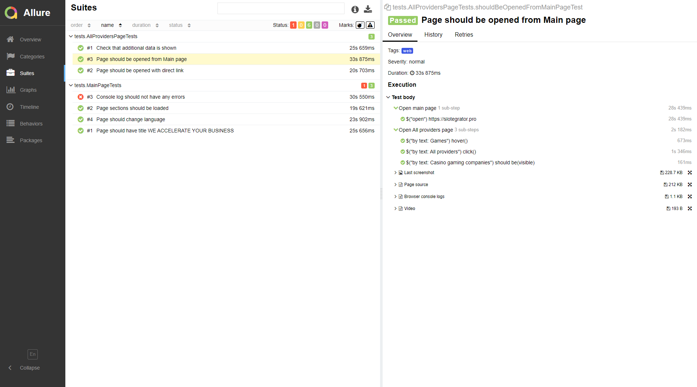

# Autotests https://www.serrala.com page
## Main page test are implemented
- [X] - Main title text is shown
- [X] - All blocks should be loaded
- [X] - Page should change language
- [X] - Sub-items in submenu is shown

## EMEA Positions page test are implemented
- [X] - Page should be opened from Main page
- [X] - Page should be opened with direct link
- [X] - Console log should not have any errors
- [X] - Search positions is work

## Added tests video

## Added allure report

## Added telegram notification

